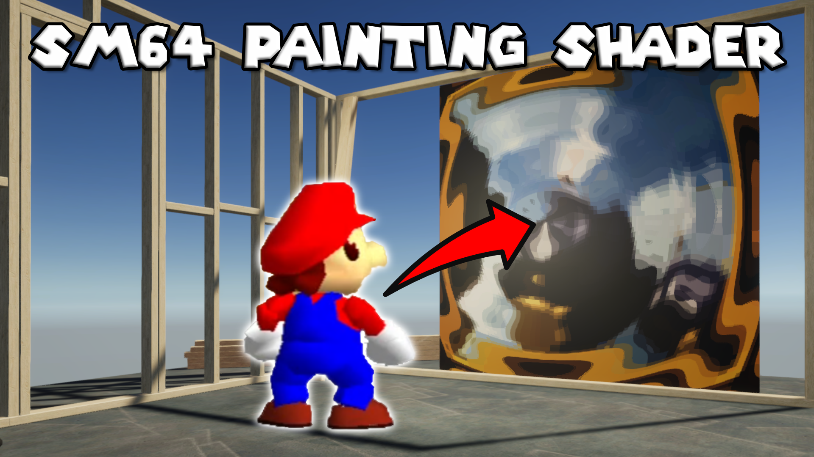

# Super Mario 64 Painting Effect in Unity Shader Graph

A shader based on Super Mario 64's painting ripple effect when Mario jumps through a painting.

## Overview

When Mario jumps through a painting in Super Mario 64, a ripple appears at the point of impact and emanates outwards. This project contains a shader which imitates that effect.

## Software

This project was created using Unity 2020.3.2f1 and Universal Render Pipeline 10.4.0.

## Authors

This project and the corresponding tutorial was created by Daniel Ilett.

## Release

This project was released publicly on July 28th 2021 alongside a [YouTube tutorial](https://www.youtube.com/watch?v=U-2SM1eoXu0) outlining the steps taken to make the effect.
